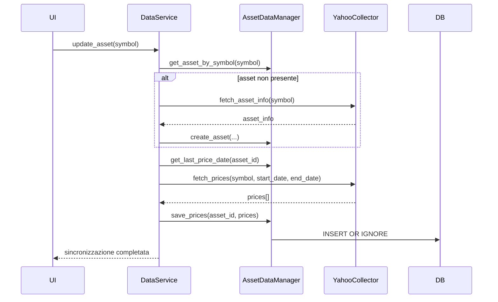
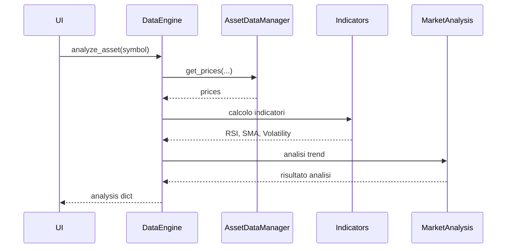

# 📈 FinanziAI App (AI-Assisted)

## 🧠 Descrizione
Questa applicazione è uno strumento locale per supportare decisioni di investimento.
L’obiettivo NON è automatizzare il trading, ma:
- analizzare dati di mercato
- monitorare il portafoglio
- generare suggerimenti intelligenti
- fornire spiegazioni chiare e comprensibili

Tutte le decisioni operative (acquisto/vendita) restano all’utente.

---

## ⚠️ Note importanti
- L'app NON esegue operazioni di trading
- NON è un consulente finanziario
- Fornisce solo supporto decisionale
- Tutte le scelte sono responsabilità dell’utente

---

## 🎯 Obiettivo finale
Costruire un sistema modulare, locale e controllabile che:
- unisce analisi quantitativa e AI
- resta trasparente nelle decisioni
- supporta (ma non sostituisce) l’investitore

---

## 🏗️ Architettura
L’applicazione è strutturata in **componenti modulari indipendenti**, organizzati su più livelli logici.

L’obiettivo è separare chiaramente:
- accesso ai dati
- elaborazione
- interpretazione
- presentazione

Il sistema è completamente **locale**, senza server e senza database remoto.

---

## 🔧 Componenti principali

### 1. **Database (SQLite + DataManager)**
**Ruolo:**  
Gestione della persistenza dati tramite SQLite (file unico `.db`).

**Componenti interni:**

**Implementati**
- `AssetDataManager`

**Pianificati**
- `PortfolioDataManager`
- `AnalysisDataManager`

**Responsabilità:**
- salvare e leggere dati
- garantire la coerenza delle informazioni
- isolare il resto dell'applicazione dai dettagli SQL

**Dati gestiti:**
- assets
- prezzi storici (`prices`)
- portafoglio
- analisi e risultati elaborati

**Quando interviene:**
- ogni volta che un dato deve essere salvato o recuperato

**Nota:**
Ogni DataManager è specializzato in una specifica area funzionale e conosce esclusivamente le tabelle di propria competenza.

Il database viene inizializzato automaticamente all'avvio dell'applicazione.
Se il file `vault.db` non esiste, viene creato utilizzando lo schema definito in `database/init_db.sql`.

---

### 2. **DataService (Orchestratore dati)**
**Ruolo:**  
Coordinare tutte le operazioni legate ai dati di mercato.

**Responsabilità:**
- aggiornare gli asset
- sincronizzare dati storici da fonti esterne
- coordinare `DataCollector` e `DataManager`
- fornire dati agli altri componenti dell'applicazione

**Quando interviene:**
- durante l'aggiornamento dei dati
- quando altri componenti richiedono dati di mercato

**Nota:**
Non contiene SQL, nè esegue analisi finanziarie.

---

### 3. **DataCollector (Sorgente dati esterna)**
**Ruolo:**  
Recuperare dati finanziari da provider esterni.

**Implementazione attuale:**
- `YahooCollector`

**Responsabilità:**
- scaricare metadati degli asset
- scaricare serie storiche dei prezzi
- normalizzare i dati in un formato comune

**Quando interviene:**
- durante le operazioni di sincronizzazione e aggiornamento

**Nota:**
Non salva direttamente nel database.

---

### 4. **DataEngine (Elaborazione dati)**
**Ruolo:**  
Trasformare dati grezzi in informazioni utilizzabili dai livelli superiori.

**Componenti interni:**

**Implementati**
- `indicators.py`
- `market_analysis.py`
- `data_engine.py`

**Pianificati**
- `portfolio_analysis.py`

**Responsabilità:**
- calcolo indicatori tecnici
- analisi di mercato
- analisi del portafoglio
- produzione di output strutturati

**Indicatori attualmente supportati:**
- RSI
- medie mobili (SMA)
- volatilità giornaliera
- volatilità annualizzata
- escursione percentuale del periodo

**Analisi attualmente supportate:**
- trend base
- classificazione della volatilità
- esposizione del portafoglio
- performance delle posizioni
- rischio di concentrazione

**Funzionalità attualmente disponibili:**
- `analyze_asset(symbol)`
- `analyze_portfolio()`

**Quando interviene:**
- dopo che i dati sono disponibili nel database
- prima della fase decisionale

**Output:**
- strutture dati contenenti indicatori e analisi numeriche

---

### 5. **Advisor (Logica decisionale / AI)**
**Ruolo:**  
Interpretare le analisi prodotte dal DataEngine e generare valutazioni comprensibili.

**Componenti interni:**
- `rules_engine.py`
- `llm_engine.py`
- `explanation.py`

**Responsabilità:**
- applicare regole decisionali
- produrre valutazioni e suggerimenti
- integrare modelli AI/LLM
- generare spiegazioni in linguaggio naturale

**Quando interviene:**
- dopo il DataEngine

**Output:**
- suggerimenti operativi
- spiegazioni testuali
- motivazioni delle valutazioni

**Nota:**
L'Advisor non accede direttamente alle sorgenti dati esterne.

---

### 6. **UI (Frontend)**
**Ruolo:**  
Interfaccia utente dell'applicazione.

**Responsabilità:**
- visualizzare dati di mercato
- visualizzare indicatori e analisi
- mostrare il portafoglio
- presentare i suggerimenti dell'Advisor
- raccogliere input dell'utente

**Tecnologie previste:**
- HTML
- JavaScript
- CSS

**Quando interviene:**
- come punto di accesso principale per l'utente

**Nota:**
La UI non contiene logica finanziaria; si limita a presentare informazioni e raccogliere input.

---

## 🔄 Flusso applicativo
## 🔄 Flusso logico

```text
Sorgenti dati esterne
        ↓
DataCollector
        ↓
DataService
        ↓
DataManager
        ↓
Database SQLite
        ↓
DataEngine
        ↓
Advisor
        ↓
UI
```

---

## 📁 Struttura del progetto
```
FinanziAI/
│
├── main.py
├── config.py
│
├── database/
│   ├── init_db.sql
│   ├── database_initializer.py
│   └── vault.db
│
├── api/
│   ├── app.py
│   ├── schemas.py
│   │
│   └── routes/
│       ├── assets.py
│       ├── analysis.py
│       └── portfolio.py
│
├── data_manager/
│   ├── asset_data_manager.py
│   ├── portfolio_data_manager.py
│   └── analysis_data_manager.py
│
├── services/
│   └── data_service.py
│
├── data_collector/
│   └── yahoo_collector.py
│
├── data_engine/
│   ├── data_engine.py
│   ├── indicators.py
│   ├── market_analysis.py
│   └── portfolio_analysis.py
│
├── advisor/
│   ├── rules_engine.py
│   ├── llm_engine.py
│   └── explanation.py
│
├── ui/
│   ├── index.html
│   ├── portfolio.html
│   ├── asset.html
│   │
│   ├── css/
│   │   └── style.css
│   │
│   └── js/
│       ├── app.js
│       ├── portfolio.js
│       └── asset.js
│
├── tests/
│   ├── 01_test_data_pipeline.py
│   ├── 02_test_data_engine.py
│   ├── 03_test_asset_data_manager.py
│   ├── 04_test_portfolio_data_manager.py
│   ├── 05_test_portfolio_analysis.py
│   ├── 06_test_portfolio_integration.py
│   └── start_test.py
│
└── utils/
    └── helpers.py
```

---

## 🧠 Principi architetturali
- Separazione delle responsabilità
- Nessun componente “tuttofare”
- SQL confinato nei DataManager
- Logica separata dai dati
- Sistema estendibile (LLM, strategie, simulazioni)

---

## ⚙️ Tecnologie utilizzate

### Backend
- Python 3
- sqlite3 (database embedded)
- pandas / numpy (analisi dati)
- yfinance (download dati finanziari)

### AI / Analisi
- Rule-based engine (fase iniziale)
- LLM locali o API (fase futura)

### Frontend
- HTML5
- JavaScript
- CSS

---

## 🔄 Sequenza: aggiornamento dati asset


## 🔄 Sequenza: analisi asset


---

## 🧪 Test Suite

Il progetto include una suite di test manuali organizzata per livelli funzionali.

I test seguono l'evoluzione dell'architettura e permettono di verificare in modo progressivo:
- acquisizione dati
- persistenza nel database
- analisi di mercato
- gestione del portafoglio
- integrazione tra componenti

Lo script `start_test.py` funge da launcher e consente di eseguire singolarmente un test oppure l'intera sequenza in ordine numerico.

```
tests/
├── 01_test_data_pipeline.py
├── 02_test_data_engine.py
├── 03_test_asset_data_manager.py
├── 04_test_portfolio_data_manager.py
├── 05_test_portfolio_analysis.py
├── 06_test_portfolio_integration.py
└── start_test.py
```

### Descrizione test

| Test	| Scopo |
|-------|--------|
| 01	| Download e sincronizzazione dati |
| 02	| Analisi asset tramite DataEngine |
| 03	| Verifica AssetDataManager |
| 04	| Verifica PortfolioDataManager |
| 05	| Verifica PortfolioAnalysis |
| 06	| Integrazione completa portfolio + DataEngine |

---

## 🚀 Roadmap

### Fase 1 — Data Layer & Ingestion (fondamenta)
- ~Implementazione database SQLite~
- ~Creazione `AssetDataManager`~
- ~Implementazione `DataService`~
- ~Integrazione `YahooCollector` (Yahoo Finance)~
- ~Download e salvataggio prezzi (con gestione duplicati)~
- ~Prime API di lettura dati (storico, ultimo prezzo)~

---

### Fase 2 — Data Engine (analisi numerica)
- ~Implementazione `DataEngine`~
- ~Calcolo indicatori base:~
  - ~RSI~
  - ~medie mobili~
  - ~volatilità~
- ~Prime analisi di mercato (trend base)~
- ~Strutturazione output dati per livelli superiori~

---

### Fase 3 — Portfolio Management
- ~Implementazione `PortfolioDataManager`~
- ~Gestione transazioni (buy/sell)~
- ~Calcolo posizione attuale~
- ~Analisi portafoglio:~
  - ~esposizione~
  - ~performance~
  - ~rischio base~

---

### Fase 4 — Backend REST API
- ~Introduzione di FastAPI~
- ~Creazione endpoint REST~
- ~Esposizione dei servizi applicativi tramite HTTP~
- ~Documentazione automatica Swagger/OpenAPI~
- ~Test degli endpoint~

#### Endpoint iniziali:
```
GET  /assets
GET  /assets/{symbol}
POST /assets/{symbol}/sync

GET  /analysis/{symbol}

GET  /portfolio
GET  /portfolio/analysis
POST /portfolio/transactions
GET    /portfolio/watchlist
POST   /portfolio/watchlist/{symbol}
DELETE /portfolio/watchlist/{symbol}
```

---

#### Fase 5 — Frontend MVP
- ~Creazione dashboard web HTML/CSS/JavaScript~
- ~Integrazione con API REST~
- ~Ricerca asset~
- ~Visualizzazione analisi~
- ~Gestione portafoglio~
- ~Gestione watchlist~
- ~Navigazione base tra le sezioni~

#### Obiettivo:
ottenere una prima applicazione utilizzabile da browser.

---

### Fase 5.5 — Data Management & Maintenance
- ~Aggiornamento automatico degli asset presenti in portfolio e watchlist~
- ~Gestione completa delle transazioni:~
  - ~consultazione~
  - ~modifica~
  - ~eliminazione~
  - ~filtro per asset e intervallo temporale~
- Introduzione pagina `transactions.html`
- Gestione avanzata dello storico prezzi:
  - visualizzazione dati disponibili
  - individuazione e recupero di periodi mancanti
  - sincronizzazione incrementale dei dati
- Consolidamento della business logic tramite servizi applicativi dedicati

#### Obiettivo:
Garantire coerenza, aggiornamento e manutenzione dei dati prima dell'introduzione dell'Advisor e dei modelli AI.

---

### Fase 6 — Advisor (logica decisionale)
- Implementazione rules_engine
- Suggerimenti rule-based
- Raccomandazioni semplici
- Produzione output testuale leggibile
- Prime spiegazioni human-friendly

---

### Fase 7 — Integrazione AI / LLM
- Introduzione `llm_engine`
- Integrazione con modelli locali o API
- Miglioramento qualità delle piegazioni
- Analisi contestuali
- Sitnesi automatica del portafoglio

---

### Fase 8 — Evoluzione avanzata
- Backtesting
- Simulazioni
- Ottimizzazione strategie
- Analisi rischio avanzata
- Fiscal tracking (plus/minusvalenze)
- Report esportabili
- Caching e ottimizzazioni performance

