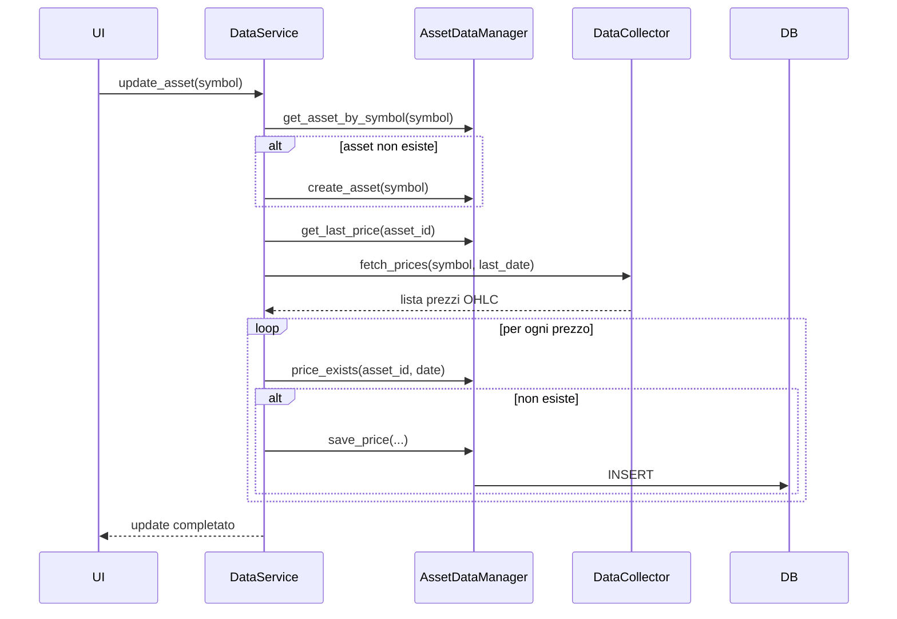

# 📈 FinanziAI App (AI-Assisted)

## 🧠 Descrizione
Questa applicazione è uno strumento locale per supportare decisioni di investimento.
L’obiettivo NON è automatizzare il trading, ma:
- analizzare dati di mercato
- monitorare il portafoglio
- generare suggerimenti intelligenti
- fornire spiegazioni chiare e comprensibili

Tutte le decisioni operative (acquisto/vendita) restano all’utente.

---

## ⚠️ Note importanti
- L'app NON esegue operazioni di trading
- NON è un consulente finanziario
- Fornisce solo supporto decisionale
- Tutte le scelte sono responsabilità dell’utente

---

## 🎯 Obiettivo finale
Costruire un sistema modulare, locale e controllabile che:
- unisce analisi quantitativa e AI
- resta trasparente nelle decisioni
- supporta (ma non sostituisce) l’investitore

---

## 🏗️ Architettura
L’applicazione è strutturata in **componenti modulari indipendenti**, organizzati su più livelli logici.

L’obiettivo è separare chiaramente:
- accesso ai dati
- elaborazione
- interpretazione
- presentazione

Il sistema è completamente **locale**, senza server e senza database remoto.

---

## 🔧 Componenti principali

### 1. **Database (SQLite + DataManager)**
**Ruolo:**
Gestione della persistenza dati tramite SQLite (file unico `.db`).

**Componenti interni:**
- `AssetDataManager`
- `PortfolioDataManager` *(futuro)*
- `AnalysisDataManager` *(futuro)*

**Responsabilità:**
- salvare e leggere dati
- garantire coerenza
- gestire:
  - assets
  - prezzi (prices)
  - portafoglio
  - analisi

**Quando interviene:**
- ogni volta che un dato deve essere salvato o letto

---

### 2. **DataService (Orchestratore dati)**
**Ruolo:**
Coordinare tutte le operazioni legate ai dati.

**Responsabilità:**
- aggiornare dati di mercato
- coordinare DataCollector e DataManager
- fornire dati agli altri componenti

**Quando interviene:**
- quando serve aggiornare un asset
- quando altri componenti richiedono dati

**Nota:**
Non contiene SQL e non esegue analisi.

---

### 3. **DataCollector (Sorgente dati esterna)**
**Ruolo:**
Recuperare dati finanziari da fonti esterne (es. Yahoo Finance).

**Responsabilità:**
- scaricare dati di mercato
- normalizzare il formato (OHLC)

**Quando interviene:**
- durante l’aggiornamento dei dati

**Nota importante:**
Non salva direttamente nel database.

---

### 4. **DataEngine (Elaborazione dati)**
**Ruolo:**
Trasformare i dati grezzi in informazioni utili.

**Responsabilità:**
- calcolo indicatori:
  - RSI
  - trend
  - volatilità
- analisi del portafoglio

**Quando interviene:**
- dopo che i dati sono disponibili nel database
- prima della fase decisionale

**Output:**
- dati strutturati (numerici, indicatori)

---

### 5. **Advisor (Logica decisionale / AI)**
**Ruolo:**
Interpretare i dati e generare suggerimenti.

**Responsabilità:**
- applicare regole logiche (fase iniziale)
- integrare modelli AI/LLM (fase avanzata)
- generare output testuale comprensibile

**Quando interviene:**
- dopo il DataEngine

**Output:**
- suggerimenti
- spiegazioni in linguaggio naturale

---

### 6. **UI (Frontend)**
**Ruolo:**
Interfaccia utente.

**Responsabilità:**
- visualizzare dati:
  - prezzi
  - indicatori
  - portafoglio
- mostrare suggerimenti dell’Advisor
- raccogliere input utente

**Tecnologie:**
- HTML
- JavaScript
- CSS

---

## 🔄 Flusso applicativo
```
Yahoo Finance
↓
DataCollector
↓
DataService
↓
DataManager (SQLite)
↓
DataEngine
↓
Advisor
↓
UI (HTML/JS)
```

---

## 📁 Struttura del progetto
```
FinanziAI/
│
├── main.py
├── config.py
│
├── data_manager/
│ ├── asset_data_manager.py
│ ├── portfolio_data_manager.py
│ └── analysis_data_manager.py
│
├── services/
│ └── data_service.py
│
├── data_collector/
│ └── yahoo_collector.py
│
├──data_engine/
│ ├── data_engine.py
│ ├── indicators.py
│ ├── market_analysis.py
│ └── portfolio_analysis.py
│
├── advisor/
│ ├── rules_engine.py
│ ├── llm_engine.py
│ └── explanation.py
│
├── ui/
│ ├── index.html
│ ├── app.js
│ └── style.css
│
└── utils/
└── helpers.py
```

---

## 🧠 Principi architetturali
- Separazione delle responsabilità
- Nessun componente “tuttofare”
- SQL confinato nei DataManager
- Logica separata dai dati
- Sistema estendibile (LLM, strategie, simulazioni)

---

## ⚙️ Tecnologie utilizzate

### Backend
- Python 3
- sqlite3 (database embedded)
- pandas / numpy (analisi dati)
- yfinance (download dati finanziari)

### AI / Analisi
- Rule-based engine (fase iniziale)
- LLM locali o API (fase futura)

### Frontend
- HTML5
- JavaScript
- CSS

---

## 🔄 Sequenza: aggiornamento dati asset


---

## 🚀 Roadmap

### Fase 1 — Data Layer & Ingestion (fondamenta)
- ~Implementazione database SQLite~
- ~Creazione `AssetDataManager`~
- ~Implementazione `DataService`~
- ~Integrazione `YahooCollector` (Yahoo Finance)~
- ~Download e salvataggio prezzi (con gestione duplicati)~
- ~Prime API di lettura dati (storico, ultimo prezzo)~

---

### Fase 2 — Data Engine (analisi numerica)
- Implementazione `DataEngine`
- Calcolo indicatori base:
  - RSI
  - medie mobili
  - volatilità
- Prime analisi di mercato (trend base)
- Strutturazione output dati per livelli superiori

---

### Fase 3 — Portfolio Management
- Implementazione `PortfolioDataManager`
- Gestione transazioni (buy/sell)
- Calcolo posizione attuale
- Analisi portafoglio:
  - esposizione
  - performance
  - rischio base

---

### Fase 4 — Advisor (logica decisionale)
- Implementazione `rules_engine`
- Generazione suggerimenti semplici (rule-based)
- Produzione output testuale leggibile
- Prime spiegazioni “human-friendly”

---

### Fase 5 — Integrazione AI / LLM
- Introduzione `llm_engine`
- Integrazione con modelli locali o API
- Miglioramento qualità suggerimenti
- Generazione spiegazioni più avanzate e contestuali

---

### Fase 6 — Evoluzione avanzata
- Ottimizzazione strategie
- Simulazioni / backtesting
- Miglioramento analisi portafoglio
- Possibile introduzione caching e ottimizzazioni performance

