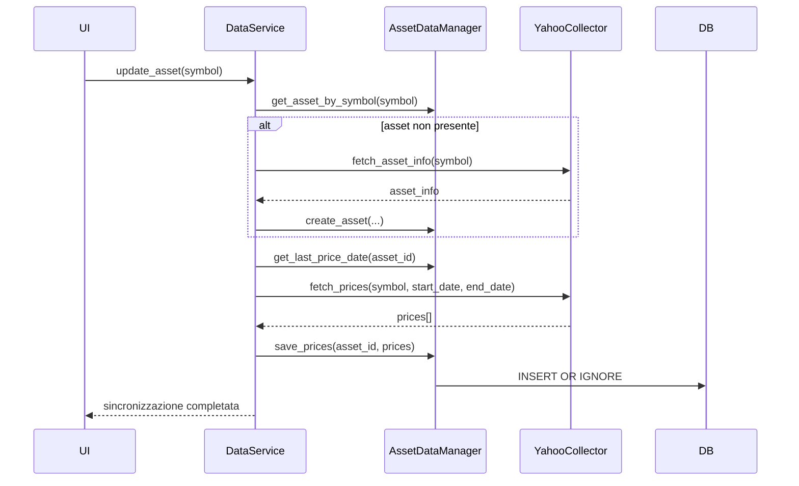
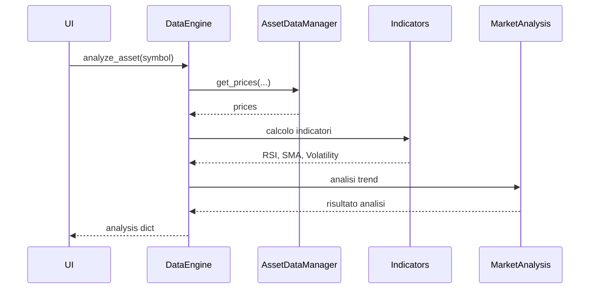

# 📈 FinanziAI App (AI-Assisted)

## 🧠 Descrizione
Questa applicazione è uno strumento locale per supportare decisioni di investimento.
L’obiettivo NON è automatizzare il trading, ma:
- analizzare dati di mercato
- monitorare il portafoglio
- generare suggerimenti intelligenti
- fornire spiegazioni chiare e comprensibili

Tutte le decisioni operative (acquisto/vendita) restano all’utente.

---

## ⚠️ Note importanti
- L'app NON esegue operazioni di trading
- NON è un consulente finanziario
- Fornisce solo supporto decisionale
- Tutte le scelte sono responsabilità dell’utente

---

## 🎯 Obiettivo finale
Costruire un sistema modulare, locale e controllabile che:
- unisce analisi quantitativa e AI
- resta trasparente nelle decisioni
- supporta (ma non sostituisce) l’investitore

---

## 🏗️ Architettura
L'applicazione è strutturata in componenti modulari indipendenti, organizzati in livelli logici.
Ogni livello ha una responsabilità ben definita:
- acquisizione e persistenza dei dati;
- analisi quantitativa;
- valutazione deterministica;
- consulenza tramite AI;
- presentazione all'utente.

L'intero sistema è progettato per funzionare localmente, utilizzando un database SQLite e modelli LLM eseguibili in locale.

---

## 🔧 Componenti principali

### 1. **Database (SQLite + DataManager)**
**Ruolo:**  
Gestione della persistenza dati tramite SQLite (file unico `.db`).

**Componenti interni:**

**Implementati**
- `AssetDataManager`

**Pianificati**
- `PortfolioDataManager`
- `AnalysisDataManager`

**Responsabilità:**
- salvare e leggere dati
- garantire la coerenza delle informazioni
- isolare il resto dell'applicazione dai dettagli SQL

**Dati gestiti:**
- assets
- prezzi storici (`prices`)
- portafoglio
- analisi e risultati elaborati

**Quando interviene:**
- ogni volta che un dato deve essere salvato o recuperato

**Nota:**
Ogni DataManager è specializzato in una specifica area funzionale e conosce esclusivamente le tabelle di propria competenza.

Il database viene inizializzato automaticamente all'avvio dell'applicazione.
Se il file `vault.db` non esiste, viene creato utilizzando lo schema definito in `database/init_db.sql`.

---

### 2. **DataService (Orchestratore dati)**
**Ruolo:**  
Coordinare tutte le operazioni legate ai dati di mercato.

**Responsabilità:**
- aggiornare gli asset
- sincronizzare dati storici da fonti esterne
- coordinare `DataCollector` e `DataManager`
- fornire dati agli altri componenti dell'applicazione

**Quando interviene:**
- durante l'aggiornamento dei dati
- quando altri componenti richiedono dati di mercato

**Nota:**
Non contiene SQL, nè esegue analisi finanziarie.

---

### 3. **DataCollector (Sorgente dati esterna)**
**Ruolo:**  
Recuperare dati finanziari da provider esterni.

**Implementazione attuale:**
- `YahooCollector`

**Responsabilità:**
- scaricare metadati degli asset
- scaricare serie storiche dei prezzi
- normalizzare i dati in un formato comune

**Quando interviene:**
- durante le operazioni di sincronizzazione e aggiornamento

**Nota:**
Non salva direttamente nel database.

---

### 4. **DataEngine (Elaborazione dati)**
**Ruolo:**  
Trasformare dati grezzi in informazioni utilizzabili dai livelli superiori.

**Componenti interni:**

**Implementati**
- `indicators.py`
- `market_analysis.py`
- `data_engine.py`

**Pianificati**
- `portfolio_analysis.py`

**Responsabilità:**
- calcolo indicatori tecnici
- analisi di mercato
- analisi del portafoglio
- produzione di output strutturati

**Indicatori attualmente supportati:**
- RSI
- medie mobili (SMA)
- volatilità giornaliera
- volatilità annualizzata
- escursione percentuale del periodo

**Analisi attualmente supportate:**
- trend base
- classificazione della volatilità
- esposizione del portafoglio
- performance delle posizioni
- rischio di concentrazione

**Funzionalità attualmente disponibili:**
- `analyze_asset(symbol)`
- `analyze_portfolio()`

**Quando interviene:**
- dopo che i dati sono disponibili nel database
- prima della fase decisionale

**Output:**
- strutture dati contenenti indicatori e analisi numeriche

---

### 5. **EvaluationEngine (Valutazione deterministica)**
**Ruolo:**
Interpretare le analisi prodotte dal DataEngine trasformandole in valutazioni strutturate.

**Responsabilità:**
- valutare i singoli asset;
- valutare il portafoglio;
- applicare regole finanziarie deterministiche;
- produrre motivazioni comprensibili;
- classificare criticità e punti di forza.

**Quando interviene:**
- dopo il DataEngine;
- prima dell'Advisor.

**Output:**
- `AssetEvaluationResult`
- `PortfolioEvaluationResult`

**Nota:**
L'EvaluationEngine non suggerisce acquisti o vendite.
Produce esclusivamente valutazioni oggettive e riproducibili che verranno successivamente interpretate dall'Advisor.

---

### 6. **AdvisorEngine (AI Assistant)**
**Ruolo:**
Interpretare il contesto finanziario completo tramite un Large Language Model (LLM) e produrre suggerimenti personalizzati.

**Responsabilità:**
- analizzare il portafoglio;
- interpretare le valutazioni prodotte dall'EvaluationEngine;
- confrontare il portafoglio con la watchlist;
- proporre miglioramenti;
- spiegare le motivazioni;
- adattare i suggerimenti al profilo dell'investitore.

**Input:**
- Portfolio
- PortfolioResult
- AssetResult del portafoglio
- PortfolioEvaluationResult
- AssetEvaluationResult
- Watchlist
- AssetResult della watchlist
- Profilo dell'investitore

**Output:**
- osservazioni;
- punti di forza;
- criticità;
- suggerimenti;
- motivazioni.

**Nota:**
L'AdvisorEngine non contiene regole finanziarie.
La logica deterministica appartiene esclusivamente all'EvaluationEngine.

---

### 7. **UI (Frontend)**
**Ruolo:**  
Interfaccia utente dell'applicazione.

**Responsabilità:**
- visualizzare dati;
- mostrare analisi quantitative;
- mostrare valutazioni dell'EvaluationEngine;
- presentare i suggerimenti dell'AdvisorEngine;
- raccogliere input dell'utente.

**Tecnologie previste:**
- HTML
- JavaScript
- CSS

**Quando interviene:**
- come punto di accesso principale per l'utente

**Nota:**
La UI non contiene logica finanziaria; si limita a presentare informazioni e raccogliere input.

---

## 🔄 Flusso logico

```text
Sorgenti dati esterne
        ↓
DataCollector
        ↓
DataService
        ↓
DataManager
        ↓
Database SQLite
        ↓
DataEngine
        ↓
EvaluationEngine
        ↓
AdvisorEngine
        ↓
UI
```

---

## 📁 Struttura del progetto
```
FinanziAI/
│
├── main.py
├── config.py
│
├── database/
│   ├── init_db.sql
│   ├── database_initializer.py
│   └── vault.db
│
├── api/
│   ├── app.py
│   ├── schemas.py
│   │
│   └── routes/
│       ├── assets.py
│       ├── analysis.py
│       └── portfolio.py
│
├── data_manager/
│   ├── asset_data_manager.py
│   ├── portfolio_data_manager.py
│   └── analysis_data_manager.py
│
├── services/
│   └── data_service.py
│
├── data_collector/
│   └── yahoo_collector.py
│
├── data_engine/
│   ├── data_engine.py
│   ├── indicators.py
│   ├── market_analysis.py
│   └── portfolio_analysis.py
│
├── evaluation_engine/
│   ├── evaluation_engine.py
│   ├── asset_evaluator.py
│   ├── portfolio_evaluator.py
│   ├── evaluation_models.py
│   └── evaluators/
│
├── advisor_engine/
│   ├── advisor_engine.py
│   ├── llm_provider.py
│   ├── prompt_builder.py
│   ├── advisor_models.py
│   └── prompts/
│
├── ui/
│   ├── index.html
│   ├── portfolio.html
│   ├── asset.html
│   │
│   ├── css/
│   │   └── style.css
│   │
│   └── js/
│       ├── app.js
│       ├── portfolio.js
│       └── asset.js
│
├── tests/
│   ├── 01_test_data_pipeline.py
│   ├── 02_test_data_engine.py
│   ├── 03_test_asset_data_manager.py
│   ├── 04_test_portfolio_data_manager.py
│   ├── 05_test_portfolio_analysis.py
│   ├── 06_test_portfolio_integration.py
│   └── start_test.py
│
└── utils/
    └── helpers.py
```

---

## 🧠 Principi architetturali
- Separazione delle responsabilità
- Nessun componente "tuttofare"
- SQL confinato nei DataManager
- Analisi quantitative separate dalle valutazioni
- Valutazioni deterministiche separate dai suggerimenti AI
- L'AI interpreta i risultati ma non sostituisce la logica finanziaria
- Sistema completamente modulare ed estendibile

---

## ⚙️ Tecnologie utilizzate

### Backend
- Python 3
- sqlite3 (database embedded)
- pandas / numpy (analisi dati)
- yfinance (download dati finanziari)

### AI / Analisi
- EvaluationEngine completamente deterministico
- llama.cpp (modelli locali)
- Modelli OpenAI compatibili (opzionale)
- Prompt personalizzabili

### Frontend
- HTML5
- JavaScript
- CSS

---

## 🔄 Sequenza: aggiornamento dati asset


## 🔄 Sequenza: analisi asset


---

## 🧪 Test Suite
Il progetto include una suite di test manuali organizzata per livelli funzionali.
I test seguono l'evoluzione dell'architettura e permettono di verificare in modo progressivo:
- acquisizione dati
- persistenza nel database
- analisi di mercato
- gestione del portafoglio
- integrazione tra componenti

Lo script `start_test.py` funge da launcher e consente di eseguire singolarmente un test oppure l'intera sequenza in ordine numerico.

```
tests/
├── 01_test_data_pipeline.py
├── 02_test_data_engine.py
├── 03_test_asset_data_manager.py
├── 04_test_portfolio_data_manager.py
├── 05_test_portfolio_analysis.py
├── 06_test_portfolio_integration.py
├── ...
└── start_test.py
```

### Descrizione test

| Test	| Scopo |
|-------|--------|
| 01	| Download e sincronizzazione dati |
| 02	| Analisi asset tramite DataEngine |
| 03	| Verifica AssetDataManager |
| 04	| Verifica PortfolioDataManager |
| 05	| Verifica PortfolioAnalysis |
| 06	| Integrazione completa portfolio + DataEngine |

---

## 🚀 Roadmap

### Fase 1 — Data Layer & Ingestion (fondamenta)
- ~Implementazione database SQLite~
- ~Creazione `AssetDataManager`~
- ~Implementazione `DataService`~
- ~Integrazione `YahooCollector` (Yahoo Finance)~
- ~Download e salvataggio prezzi (con gestione duplicati)~
- ~Prime API di lettura dati (storico, ultimo prezzo)~

---

### Fase 2 — Data Engine (analisi numerica)
- ~Implementazione `DataEngine`~
- ~Calcolo indicatori base:~
  - ~RSI~
  - ~medie mobili~
  - ~volatilità~
- ~Prime analisi di mercato (trend base)~
- ~Strutturazione output dati per livelli superiori~

---

### Fase 3 — Portfolio Management
- ~Implementazione `PortfolioDataManager`~
- ~Gestione transazioni (buy/sell)~
- ~Calcolo posizione attuale~
- ~Analisi portafoglio:~
  - ~esposizione~
  - ~performance~
  - ~rischio base~

---

### Fase 4 — Backend REST API
- ~Introduzione di FastAPI~
- ~Creazione endpoint REST~
- ~Esposizione dei servizi applicativi tramite HTTP~
- ~Documentazione automatica Swagger/OpenAPI~
- ~Test degli endpoint~

#### Endpoint iniziali:
```
GET  /assets
GET  /assets/{symbol}
POST /assets/{symbol}/sync

GET  /analysis/{symbol}

GET  /portfolio
GET  /portfolio/analysis
POST /portfolio/transactions
GET    /portfolio/watchlist
POST   /portfolio/watchlist/{symbol}
DELETE /portfolio/watchlist/{symbol}
```

---

#### Fase 5 — Frontend MVP
- ~Creazione dashboard web HTML/CSS/JavaScript~
- ~Integrazione con API REST~
- ~Ricerca asset~
- ~Visualizzazione analisi~
- ~Gestione portafoglio~
- ~Gestione watchlist~
- ~Navigazione base tra le sezioni~

#### Obiettivo:
ottenere una prima applicazione utilizzabile da browser.

---

### Fase 5.5 — Data Management & Maintenance
- ~Aggiornamento automatico degli asset presenti in portfolio e watchlist~
- ~Gestione completa delle transazioni:~
  - ~consultazione~
  - ~modifica~
  - ~eliminazione~
  - ~filtro per asset e intervallo temporale~
- ~Introduzione pagina `transactions.html`~
- ~Versione 0.1.1 con currency support~
- ~Gestione avanzata dello storico prezzi:~
  - ~visualizzazione dati disponibili~
  - ~individuazione e recupero di periodi mancanti~
  - ~sincronizzazione incrementale dei dati~
- ~Consolidamento della business logic tramite servizi applicativi dedicati~

#### Obiettivo:
Garantire coerenza, aggiornamento e manutenzione dei dati prima dell'introduzione dell'Advisor e dei modelli AI.

---

### Fase 6 — Evaluation Engine
- ~Implementazione EvaluationEngine~
- ~Valutazione deterministica degli asset~
- ~Valutazione deterministica del portafoglio~
- ~Produzione di motivazioni strutturate~
- ~Integrazione completa nella UI~

---

### Fase 7 — Advisor Engine (LLM)
- ~Implementazione AdvisorEngine~
- ~Integrazione llama.cpp~
- ~Costruzione automatica del prompt~
- ~Definizione dei profili investitore~
- ~Analisi contestuale del portafoglio~
- ~Confronto con la watchlist~
- ~Produzione di suggerimenti motivati~

---

### Fase 8 — Evoluzione avanzata
- ~Memoria conversazionale dell'Advisor~
- Personalizzazione dei prompt
- Backtesting
- Fiscal tracking
- Report esportabili
- Ottimizzazione delle performance

