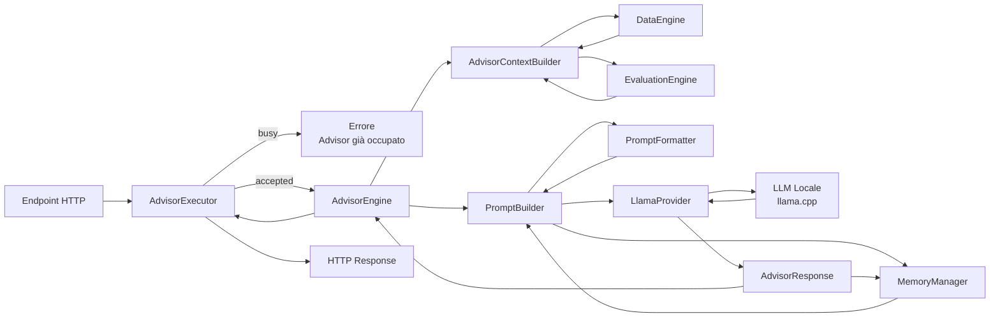

# AdvisorEngine

## Descrizione
L'AdvisorEngine rappresenta il livello più alto dell'architettura di FinanziAI.
Il suo compito **non è eseguire analisi finanziarie**, ma trasformare le informazioni già prodotte dal sistema in una consulenza comprensibile e contestualizzata.

L'AdvisorEngine utilizza esclusivamente:
- `DataEngine`
- `EvaluationEngine`
- un LLM locale tramite `llama-cpp-python`

L'LLM non rappresenta la fonte della verità del sistema. Tutte le informazioni numeriche, gli indicatori, le valutazioni e i dati di mercato sono prodotti dai moduli deterministici (DataEngine ed EvaluationEngine). Il modello linguistico ha esclusivamente il compito di interpretare tali informazioni e comunicarle in linguaggio naturale.

Riceve esclusivamente dati già elaborati e produce:
- spiegazioni
- suggerimenti
- motivazioni
- confronto con la watchlist
- risposta alle domande dell'utente

---

# Architettura
```text
advisor_engine/
│
├── ai_provider.py				# Interfaccia comune dei provider AI
├── advisor_executor.py			# Boundary di esecuzione concorrente
├── advisor_engine.py			# Orchestrazione della consulenza
├── advisor_context_builder.py	# Raccolta dati da DataEngine/EvaluationEngine
├── prompt_builder.py			# Costruzione automatica del prompt
├── llama_provider.py			# Implementazione locale tramite llama-cpp
├── advisor_models.py			# DTO interni
│
├── formatters/
│   ├── data_formatter.py
│   ├── evaluation_formatter.py
│   ├── prompt_formatter.py
│   └── utils.py
│
├── memory/
│   ├── memory_manager.py
│   ├── memory_models.py
│   └── conversation_store.py
│
├── prompts/
│   ├── system_prompt.txt
│   └── user_prompt.txt
│
└── models/
    └── model.gguf
```

---

# Componenti

## AdvisorEngine

### Responsabilità
Contiene l'intera logica di orchestrazione della consulenza finanziaria.
Assume che l'esecuzione sia già stata autorizzata dall'AdvisorExecutor e non gestisce aspetti concorrenti o sincronizzazione.
Orchestra tutte le operazioni necessarie per ottenere una consulenza.
Non contiene logica di costruzione del prompt né di accesso al modello.

### Input
- richiesta dell'utente
- profilo investitore

### Output
- risposta dell'Advisor

### Possibile interfaccia
```python
class AdvisorEngine:

    def advise(
        self,
        user_prompt: str,
        investor_profile: InvestorProfile
    ) -> AdvisorResponse:
        ...
```

---

## AdvisorExecutor

### Responsabilità
Rappresenta il punto di ingresso concorrente dell'Advisor.
Il suo compito è garantire che una sola richiesta venga elaborata per volta, evitando che più invocazioni simultanee saturino il modello LLM locale o producano uno stato inconsistente della memoria conversazionale.
L'implementazione iniziale utilizza una strategia estremamente semplice:
- una sola elaborazione attiva;
- eventuali richieste concorrenti vengono immediatamente rifiutate.

Questa scelta privilegia prevedibilità, semplicità e protezione delle risorse rispetto al throughput.
In futuro il componente potrà evolvere senza modificare l'AdvisorEngine introducendo, ad esempio:
- coda FIFO;
- priorità delle richieste;
- code indipendenti per utente;
- timeout;
- cancellazione delle richieste;
- metriche di utilizzo.

### Input
```python
AdvisorRequest
```

### Output
```python
AdvisorResponse
```

oppure un errore applicativo indicante che è già presente un'elaborazione in corso.

### Possibile interfaccia
```python
class AdvisorExecutor:

    def execute(self, request: AdvisorRequest) -> AdvisorResponse:
        ...
```

---

## AdvisorContextBuilder

### Responsabilità
Recupera tutte le informazioni necessarie dagli engine esistenti.

Utilizza:
- DataEngine
- EvaluationEngine

Costruisce un unico oggetto contenente tutto il contesto necessario.

### Recupera
- Portfolio
- Asset
- Valutazioni del portafoglio
- Valutazioni degli asset
- Watchlist
- Informazioni applicative
- Profilo investitore

### Input
```python
InvestorProfile
```

### Output
```python
AdvisorContext
```

### Possibile interfaccia
```python
class AdvisorContextBuilder:

    def build(
        self,
        profile: InvestorProfile
    ) -> AdvisorContext:
        ...
```

---

## PromptBuilder

### Responsabilità
Trasforma l'intero contesto in un prompt ottimizzato per il modello.
Internamente:
- utilizza `PromptFormatter` per convertire i DTO applicativi in una rappresentazione testuale semplice e compatta;
- recupera dal MemoryManager una finestra della conversazione compatibile con il budget di token del modello.
- inserisce entrambe le informazioni nei template Jinja;
- costruisce il prompt finale.

Non dialoga con il modello.

### Input
```python
AdvisorContext
user_prompt
```

### Dipendenze
- PromptFormatter
- MemoryManager


### Output
```text
Prompt completo
```

### Possibile interfaccia
```python
class PromptBuilder:

    def build(
        self,
        context: AdvisorContext,
        user_prompt: str
    ) -> Prompt:
        ...
```

---

## MemoryManager

### Responsabilità
Gestisce la memoria conversazionale dell'Advisor.
Il componente conserva gli ultimi turni della conversazione e, durante la costruzione del prompt, ricostruisce dinamicamente una finestra di memoria compatibile con il budget massimo di token configurato (`MAX_MEMORY_TOKENS`).
Quando disponibile utilizza il tokenizer esposto dal provider AI per stimare con precisione il numero di token; in assenza di un tokenizer utilizza una stima approssimata basata sulla lunghezza del testo.
Il `MemoryManager` rimane completamente indipendente dall'implementazione del modello linguistico e degrada automaticamente su una strategia generica.

### Input
- messaggio dell'utente
- risposta dell'assistente

### Output
Una rappresentazione testuale della memoria conversazionale pronta per essere inserita nel prompt.

### Possibile interfaccia
```python
class MemoryManager:
    def add_turn(...) -> None:
        ...

    def build_memory(self) -> str:
        ...

    def get_history(self) -> ConversationHistory:
        ...

    def clear(self) -> None:
        ...
```

---

## AIProvider

### Responsabilità
Definisce l'interfaccia comune che ogni backend AI deve implementare.
Permette di sostituire il modello linguistico senza modificare il resto dell'AdvisorEngine.

### Interfaccia
```python
class AIProvider(ABC):

    @property
    def model_name(self) -> str:
        ...

    def generate(...) -> AdvisorResponse:
        ...

    def count_tokens(text: str) -> int:
        ...
```

`LlamaProvider` rappresenta l'attuale implementazione locale basata su `llama-cpp-python`.

---

## LlamaProvider

### Responsabilità
Incapsula completamente `llama-cpp-python`.
Il resto dell'applicazione non conosce il modello utilizzato.
Permette in futuro di sostituire il backend con altri provider.
Oltre alla generazione delle risposte espone il conteggio dei token del modello tramite `count_tokens()`, utilizzato dal `MemoryManager` per costruire una finestra di memoria compatibile con il contesto disponibile.

### Input
Prompt

### Output
Risposta del modello

### Possibile interfaccia
```python
class LlamaProvider:

    def generate(
		*,
		system_prompt: str,
		user_prompt: str,
    ) -> AdvisorResponse:
        ...
```

Internamente utilizza:
```python
from llama_cpp import Llama
```

---

## InvestorProfile

### Responsabilità
Descrive il profilo dell'investitore.
Può essere utilizzato per modificare il comportamento dell'Advisor.

Esempio:
- Prudente
- Bilanciato
- Dinamico
- Aggressivo

### Possibile modello
```python
class InvestorProfile(Enum):

    PRUDENT = "prudent"
    BALANCED = "balanced"
    DYNAMIC = "dynamic"
    AGGRESSIVE = "aggressive"
```

---

## AdvisorModels
Contiene esclusivamente DTO.

Ad esempio:
```text
AdvisorContext

AdvisorRequest

Prompt

AdvisorResponse

InvestorProfile
```

Nessuna logica.

---

# Flusso di esecuzione


---

# Sequenza delle operazioni
```text
1. L'utente invia una richiesta.
2. AdvisorExecutor verifica che non sia già presente un'elaborazione attiva.
3. Se il sistema è occupato la richiesta viene rifiutata.
4. AdvisorEngine riceve la richiesta.
5. AdvisorContextBuilder recupera:
   • portafoglio
   • asset
   • watchlist
   • valutazioni
   • profilo investitore
6. PromptBuilder:
   • formatta il contesto applicativo
   • recupera la memoria conversazionale
   • costruisce il prompt completo
7. LlamaProvider invia il prompt al modello locale.
8. Il modello produce una risposta.
9. MemoryManager registra il nuovo turno della conversazione.
10. AdvisorEngine restituisce la risposta.
11. AdvisorExecutor libera il lock di esecuzione.
```

---

# Filosofia dell'architettura
Ogni componente ha una singola responsabilità.

| Componente | Responsabilità |
|------------|----------------|
| AdvisorExecutor | Controlla l'accesso concorrente all'AdvisorEngine garantendo una sola elaborazione alla volta |
| DataEngine | Produce dati quantitativi |
| EvaluationEngine | Interpreta i dati tramite regole deterministiche |
| AdvisorContextBuilder | Aggrega il contesto finanziario corrente |
| PromptFormatter | Converte il contesto applicativo in testo |
| MemoryManager | Gestisce la memoria conversazionale rispettando il budget di token |
| PromptBuilder | Costruisce il prompt completo per il modello |
| AIProvider | Definisce l'interfaccia comune dei provider AI |
| LlamaProvider | Implementazione locale dell'AIProvider tramite llama.cpp |
| AdvisorEngine | Orchestra l'intero flusso di consulenza |

---

# Vantaggi
- Separazione completa delle responsabilità.
- Il modello AI è completamente isolato.
- Possibilità di sostituire il modello senza modificare il resto del sistema.
- Prompt centralizzato e facilmente migliorabile.
- Architettura facilmente testabile tramite mock.
- Nessuna logica finanziaria delegata al modello.
- Gestione della memoria completamente disaccoppiata dal dominio finanziario.
- Possibilità di evolvere la memoria senza modificare AdvisorContext o PromptFormatter.
- Interfaccia stabile del MemoryManager indipendentemente dalla strategia di memorizzazione adottata.
- Protezione del modello LLM da richieste concorrenti.
- Punto unico per la gestione della concorrenza e delle future code di esecuzione.
- AdvisorEngine completamente ignaro delle problematiche di sincronizzazione.
- I provider AI sono completamente intercambiabili tramite l'interfaccia `AIProvider`.
- La memoria conversazionale utilizza il budget di token del modello invece di un semplice numero di messaggi.
- Il conteggio dei token è preciso quando il provider lo supporta e dispone di un fallback indipendente dal modello.

---

# Roadmap

## Fase 1 — Infrastruttura
- integrazione `llama-cpp-python`
- caricamento del modello locale
- gestione del contesto
- costruzione automatica del prompt

## Fase 2 — Contestualizzazione
- definizione dei profili investitore
- utilizzo delle analisi del DataEngine
- utilizzo delle valutazioni dell'EvaluationEngine
- confronto con la watchlist

## Fase 3 — Consulenza
- suggerimenti motivati
- spiegazione dei rischi
- spiegazione dei benefici
- risposta alle domande dell'utente
- memoria conversazionale della sessione

## Fase 4 — Evoluzione della memoria
- riassunto automatico delle conversazioni meno recenti
- memoria persistente tra più sessioni
- preferenze dell'utente
- eventi applicativi significativi
- personalizzazione progressiva dell'Advisor