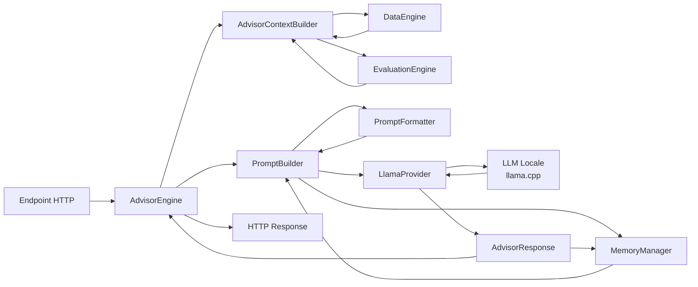

# AdvisorEngine

## Descrizione
L'AdvisorEngine rappresenta il livello più alto dell'architettura di FinanziAI.
Il suo compito **non è eseguire analisi finanziarie**, ma trasformare le informazioni già prodotte dal sistema in una consulenza comprensibile e contestualizzata.

L'AdvisorEngine utilizza esclusivamente:
- `DataEngine`
- `EvaluationEngine`
- un LLM locale tramite `llama-cpp-python`

L'LLM non rappresenta la fonte della verità del sistema. Tutte le informazioni numeriche, gli indicatori, le valutazioni e i dati di mercato sono prodotti dai moduli deterministici (DataEngine ed EvaluationEngine). Il modello linguistico ha esclusivamente il compito di interpretare tali informazioni e comunicarle in linguaggio naturale.

Riceve esclusivamente dati già elaborati e produce:
- spiegazioni
- suggerimenti
- motivazioni
- confronto con la watchlist
- risposta alle domande dell'utente

---

# Architettura
```text
advisor_engine/
│
├── advisor_engine.py          # Facade principale
├── advisor_context_builder.py # Raccolta dati da DataEngine/EvaluationEngine
├── prompt_builder.py          # Costruzione automatica del prompt
├── llama_provider.py          # Wrapper llama-cpp-python
├── advisor_models.py          # DTO interni
│
├── formatters/
│   ├── data_formatter.py
│   ├── evaluation_formatter.py
│   ├── prompt_formatter.py
│   └── utils.py
│
├── memory/
│   ├── memory_manager.py
│   ├── memory_models.py
│   └── conversation_store.py
│
├── prompts/
│   ├── system_prompt.txt
│   └── user_prompt.txt
│
└── models/
    └── model.gguf
```

---

# Componenti

## AdvisorEngine

### Responsabilità
È la facade dell'intero modulo.
Orchestra tutte le operazioni necessarie per ottenere una consulenza.
Non contiene logica di costruzione del prompt né di accesso al modello.

### Input
- richiesta dell'utente
- profilo investitore

### Output
- risposta dell'Advisor

### Possibile interfaccia
```python
class AdvisorEngine:

    def advise(
        self,
        user_prompt: str,
        investor_profile: InvestorProfile
    ) -> AdvisorResponse:
        ...
```

---

## AdvisorContextBuilder

### Responsabilità
Recupera tutte le informazioni necessarie dagli engine esistenti.

Utilizza:
- DataEngine
- EvaluationEngine

Costruisce un unico oggetto contenente tutto il contesto necessario.

### Recupera
- Portfolio
- Asset
- Valutazioni del portafoglio
- Valutazioni degli asset
- Watchlist
- Informazioni applicative
- Profilo investitore

### Input
```python
InvestorProfile
```

### Output
```python
AdvisorContext
```

### Possibile interfaccia
```python
class AdvisorContextBuilder:

    def build(
        self,
        profile: InvestorProfile
    ) -> AdvisorContext:
        ...
```

---

## PromptBuilder

### Responsabilità
Trasforma l'intero contesto in un prompt ottimizzato per il modello.
Internamente:
- utilizza `PromptFormatter` per convertire i DTO applicativi in una rappresentazione testuale semplice e compatta;
- recupera la memoria conversazionale dal `MemoryManager`;
- inserisce entrambe le informazioni nei template Jinja;
- costruisce il prompt finale.

Non dialoga con il modello.

### Input
```python
AdvisorContext
user_prompt
```

### Dipendenze
- PromptFormatter
- MemoryManager


### Output
```text
Prompt completo
```

### Possibile interfaccia
```python
class PromptBuilder:

    def build(
        self,
        context: AdvisorContext,
        user_prompt: str
    ) -> Prompt:
        ...
```

---

## MemoryManager

### Responsabilità
Gestisce la memoria conversazionale dell'Advisor.
L'obiettivo è fornire al modello il contesto delle interazioni precedenti senza modificare il dominio applicativo (`AdvisorContext`) e senza introdurre dipendenze tra la memoria e gli engine finanziari.
Il `MemoryManager` è completamente indipendente dal processo di raccolta dei dati di portafoglio e viene interrogato esclusivamente dal `PromptBuilder` durante la costruzione del prompt.
Attualmente il componente mantiene una finestra configurabile degli ultimi turni della conversazione (utente ↔ assistente) e restituisce una rappresentazione testuale pronta per essere inserita nel prompt.
In futuro lo stesso componente potrà evolvere mantenendo invariata l'interfaccia pubblica, diventando il punto centralizzato per la gestione della memoria dell'Advisor, ad esempio introducendo:
- riassunti automatici delle conversazioni più vecchie;
- preferenze espresse dall'utente;
- decisioni prese durante la sessione;
- eventi significativi dell'applicazione;
- memoria persistente tra più sessioni.

L'architettura è volutamente progettata affinché tali evoluzioni non richiedano modifiche né al `PromptBuilder` né agli altri componenti dell'AdvisorEngine.

### Input
- messaggio dell'utente
- risposta dell'assistente

### Output
Una rappresentazione testuale della memoria conversazionale pronta per essere inserita nel prompt.

### Possibile interfaccia
```python
class MemoryManager:

    def add_turn(
        self,
        user_message: str,
        assistant_message: str,
    ) -> None:
        ...

    def build_memory(self) -> str:
        ...

    def clear(self) -> None:
        ...
```

---

## LlamaProvider

### Responsabilità
Incapsula completamente `llama-cpp-python`.
Il resto dell'applicazione non conosce il modello utilizzato.
Permette in futuro di sostituire il backend con altri provider.

### Input
Prompt

### Output
Risposta del modello

### Possibile interfaccia

```python
class LlamaProvider:

    def generate(
		*,
		system_prompt: str,
		user_prompt: str,
    ) -> AdvisorResponse:
        ...
```

Internamente utilizza:
```python
from llama_cpp import Llama
```

---

## InvestorProfile

### Responsabilità
Descrive il profilo dell'investitore.
Può essere utilizzato per modificare il comportamento dell'Advisor.

Esempio:
- Prudente
- Bilanciato
- Dinamico
- Aggressivo

### Possibile modello
```python
class InvestorProfile(Enum):

    PRUDENT = "prudent"
    BALANCED = "balanced"
    DYNAMIC = "dynamic"
    AGGRESSIVE = "aggressive"
```

---

## AdvisorModels
Contiene esclusivamente DTO.

Ad esempio:
```text
AdvisorContext

AdvisorRequest

Prompt

AdvisorResponse

InvestorProfile
```

Nessuna logica.

---

# Flusso di esecuzione


---

# Sequenza delle operazioni
```text
1. L'utente invia una richiesta.

2. L'AdvisorEngine riceve la richiesta.

3. AdvisorContextBuilder recupera:
   • portafoglio
   • asset
   • watchlist
   • valutazioni
   • profilo investitore

4. PromptBuilder:
   • formatta il contesto applicativo
   • recupera la memoria conversazionale dal MemoryManager
   • costruisce il prompt completo

5. LlamaProvider invia il prompt al modello locale.

6. Il modello produce una risposta.

7. Il MemoryManager registra il nuovo turno della conversazione.

8. L'AdvisorEngine restituisce la risposta all'utente.
```

---

# Filosofia dell'architettura
Ogni componente ha una singola responsabilità.

| Componente | Responsabilità |
|------------|----------------|
| DataEngine | Produce dati quantitativi |
| EvaluationEngine | Interpreta i dati tramite regole deterministiche |
| AdvisorContextBuilder | Aggrega il contesto finanziario corrente |
| PromptFormatter | Converte il contesto applicativo in testo |
| MemoryManager | Gestisce la memoria conversazionale della sessione |
| PromptBuilder | Costruisce il prompt completo per il modello |
| LlamaProvider | Comunica con il modello locale |
| AdvisorEngine | Orchestra l'intero flusso |

---

# Vantaggi
- Separazione completa delle responsabilità.
- Il modello AI è completamente isolato.
- Possibilità di sostituire il modello senza modificare il resto del sistema.
- Prompt centralizzato e facilmente migliorabile.
- Architettura facilmente testabile tramite mock.
- Nessuna logica finanziaria delegata al modello.
- Gestione della memoria completamente disaccoppiata dal dominio finanziario.
- Possibilità di evolvere la memoria senza modificare AdvisorContext o PromptFormatter.
- Interfaccia stabile del MemoryManager indipendentemente dalla strategia di memorizzazione adottata.

---

# Roadmap

## Fase 1 — Infrastruttura
- integrazione `llama-cpp-python`
- caricamento del modello locale
- gestione del contesto
- costruzione automatica del prompt

## Fase 2 — Contestualizzazione
- definizione dei profili investitore
- utilizzo delle analisi del DataEngine
- utilizzo delle valutazioni dell'EvaluationEngine
- confronto con la watchlist

## Fase 3 — Consulenza
- suggerimenti motivati
- spiegazione dei rischi
- spiegazione dei benefici
- risposta alle domande dell'utente
- memoria conversazionale della sessione

## Fase 4 — Evoluzione della memoria
- riassunto automatico delle conversazioni meno recenti
- memoria persistente tra più sessioni
- preferenze dell'utente
- eventi applicativi significativi
- personalizzazione progressiva dell'Advisor